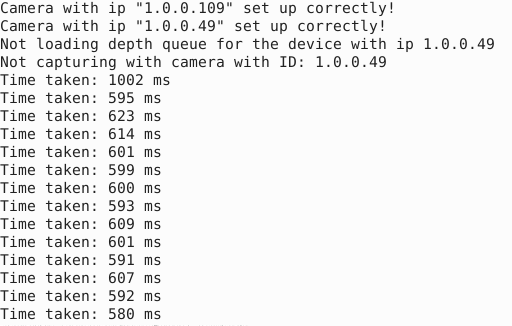
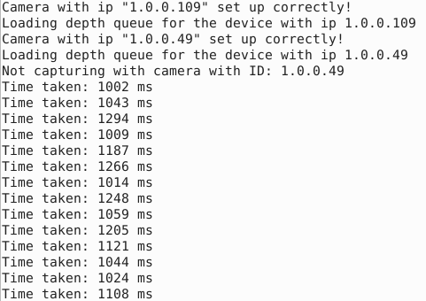

# Description
A minimal example to reproduce an issue with DepthAI and multiprocessing.

### Issue description
There is a delay in receiving synchronized RGB-D data that occurs when using some of the DepthAI OAK-D Pro PoE cameras together, in particular, after starting the Depth queues of multiple devices from dedicated processes. 

This delay is not present when only one camera's depth queue is initialized. It also depends on the cameras that are used together. Some camera combinations do not introduce the delay, while other do.

- Behavior without a delay, **not loading depth queue** of the second camera, not capturing images with the second camera:

- Behavior with the delay, **loading depth queue** of the second camera, not capturing images with the second camera:

### Steps to reproduce the behavior
- Start the main process, create and start a separate worker process for each camera.
- Use at least two cameras. If the issue cannot be reproduced, try several combinations of cameras and vary the order of camera loading since one camera can have the delay, while another does not. The more cameras are used together, the more likely the issue is to happen.
- In the worker process, initialize the camera with RGB-D pipeline.
- Start the camera queues: Control queue, RGB queue, **Depth queue**
- Capture synchronized RGB-D images by only one camera to avoid influence of data transfer with multiple cameras
- **Observe delay if depth queue of another camera(s) is initialized**
- **If the depth queue of the other camera(s) is not initialized, there is no delay**, even if the device is started and Control and RGB queues are initialized

### Expected behavior
Starting the depth queue of a camera without data transfer to the host should not affect the data transfer speed of other cameras.

### Additional context
- The issue can be reproduced consistently using the minimal code sample provided here.
- The issue persists even if the frames are not requested from the cameras other than the first one, and yet the delay still occurs when the depth queue of another camera is initialized.
- Experimented with replacing the cable of the camera that has a delay (in combination with first camera) with the one plugged in a camera that does not have a delay (in combination with the first camera), but it did not resolve the issue.
- From the above points, it can be concluded that it is not a network issue, nor it is an issue of the camera hardware or firmware. It appears to be caused by DepthAI using shared memory and not handling device queues separately (during starting the depth queue).
- Introducing a delay to loading the device depth queue sometimes changes the camera that is experiencing the delay.
- The delay does not happen if one camera runs in the RGB-D mode and the second runs in RGB mode.

### Code usage

- Clone the repository: `git clone https://github.com/yuriyOn/depthai-multiprocessing-issue.git`
- Install the depthai-python library, version 2.20.2.
- Connect multiple OAK-D Pro PoE devices to the host machine.
- Specify IP addresses of the devices in the `main.py` file (line 52)
- To load all device queues and **observe the delay in data transfer speed**, run the command from the root directory: 
  - `python main.py`
- To remove the delay by disabling loading the depth queue of the devices other than the first one, run: 
  - `python main.py -d`

### Files description

The code consists of the following files:
- `main.py`: main process that creates and starts a separate process per each camera, given the camera IP-s
- `workers.py`: worker process that loads and starts a device, and captures RGB-D images with the first camera only, synchronising them and logging the acquisition time. It has an option to load the depth queue of all the cameras, or the first camera only - to reproduce the issue.
- `utils.py`: time-based synchronisation class
- `pipeline.py`: depthai pipeline definition that includes the color camera, mono cameras and stereo

### System details
Partial output of the `log_system_information.py` script:
- OS: Ubuntu 22.04.1 LTS
- Network speed: 1 Gbps
- DepthAI Python version: 2.20.2.0
- architecture: 64bit ELF
- processor: x86_64
- platform: Linux-5.19
- python version: 3.9.15
- python build: Nov 24 2022
- python compiler: GCC 11.2.0
- python implementation: CPython
